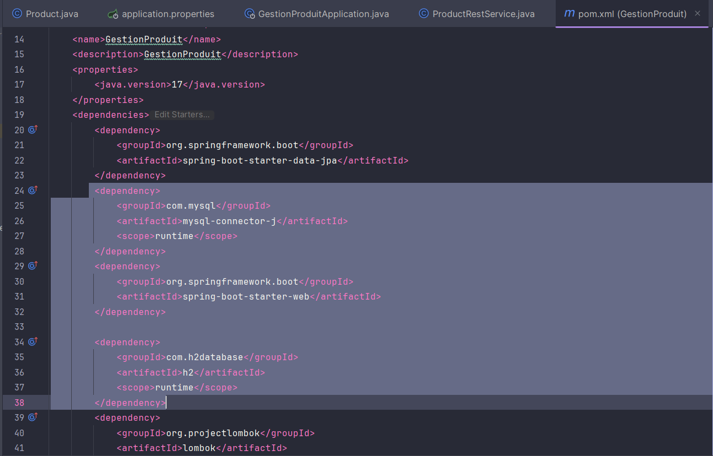
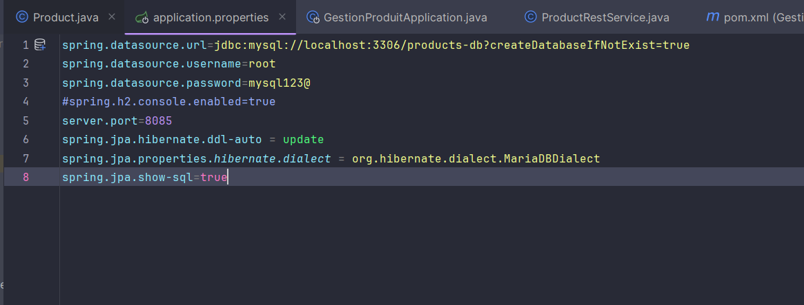
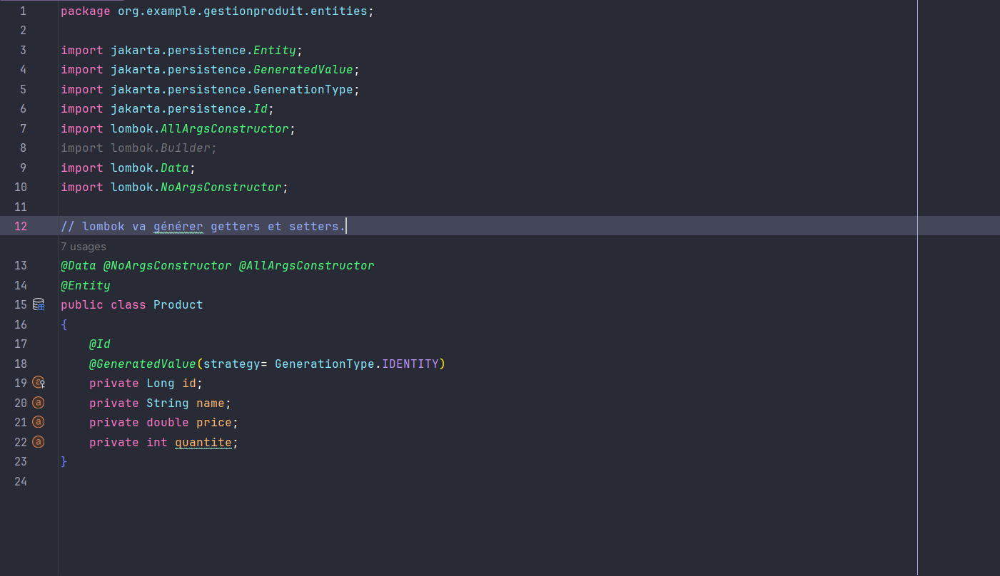
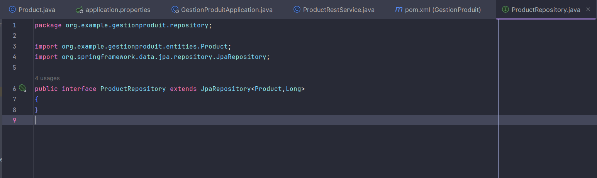
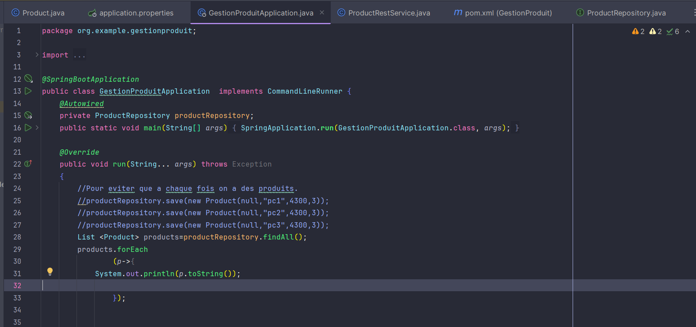

<h1>Compte rendu:</h1>
<h2>Gestion de produits :</h2>

Ce projet est pour la gestion des projet en utilisant Sring Data , JPA , h2 database et mySQL en configurant le fichier "application.properties" .
Voici les différentes parties de mon code :

<h3>Ajout des dépandances :</h3>

<h3>Configuration du fichier application.properties :</h3>

<h3>L'entité produit:</h3>

<h3>L'interface ProduitRepository :</h3>

<h3>L'application :</h3>

<h3>Le webService :</h3>

